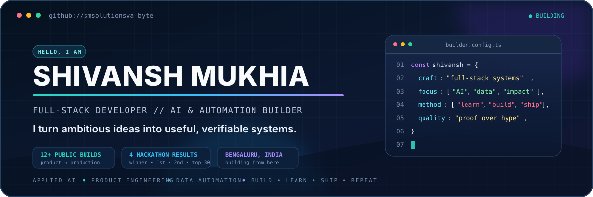

<!--
  Profile README for github.com/smsolutionsva-byte
  Built from Shivansh Mukhia's verified resume and public repositories.
-->

  

  
  
  

  

## The short version

I'm **Shivansh Mukhia** - a full-stack developer and B.Tech Computer Science student in Bengaluru. I build at the intersection of **product engineering, applied AI, and automation**: from air-gapped evidence retrieval and satellite semantic search to outcome-trained chess and finance-operations tools.

My rule for good software: **local when it should be, verifiable when it matters, and useful to the person at the keyboard.**

<table>
  <tr>
    <td align="center"><strong>12+</strong> public builds</td>
    <td align="center"><strong>4</strong> hackathon results</td>
    <td align="center"><strong>3</strong> builder lanes</td>
    <td align="center"><strong>2029</strong> B.Tech CSE</td>
  </tr>
</table>

## What I build

<table>
  <tr>
    <td width="33%" valign="top">
      <h3>🧠 Applied AI</h3>
      
Semantic retrieval, multimodal evidence, NLP, safety-aware assistants, and reinforcement-learning systems.

    </td>
    <td width="33%" valign="top">
      <h3>⚙️ Product systems</h3>
      
Responsive frontends, practical APIs, offline-first workflows, and end-to-end tools that people can actually use.

    </td>
    <td width="33%" valign="top">
      <h3>📊 Data automation</h3>
      
Analytics, SQLite-backed operations, Excel/document pipelines, dashboards, audits, and workflow automation.

    </td>
  </tr>
</table>

## Flagship systems

<table>
  <tr>
    <td width="50%" valign="top">
      <h3><a href="https://github.com/smsolutionsva-byte/Axiom">Axiom</a></h3>
      
<strong>Offline multimodal intelligence workspace.</strong> Ingests local evidence, runs hybrid retrieval, validates citations against source chunks, and keeps an auditable SQLite trail for air-gapped environments.

      
<code>Python</code> <code>SQLite</code> <code>OCR/Vision</code> <code>Hybrid Retrieval</code>

    </td>
    <td width="50%" valign="top">
      <h3><a href="https://github.com/smsolutionsva-byte/DeepQuery">DeepQuery</a></h3>
      
<strong>Semantic search for geospatial telemetry.</strong> Uses dense embeddings and cosine-similarity retrieval to query satellite, environmental, and text data through structured FastAPI endpoints.

      
<code>Python</code> <code>FastAPI</code> <code>Embeddings</code> <code>Vector Search</code>

    </td>
  </tr>
  <tr>
    <td width="50%" valign="top">
      <h3><a href="https://github.com/smsolutionsva-byte/Grace">Grace</a></h3>
      
<strong>Outcome-trained chess research system.</strong> A policy/value network learns with actor-critic reinforcement learning from terminal results - without opening books, coded piece values, or handcrafted chess heuristics.

      
<code>Python</code> <code>PyTorch</code> <code>Actor-Critic RL</code> <code>Self-Play</code>

    </td>
    <td width="50%" valign="top">
      <h3><a href="https://github.com/smsolutionsva-byte/ledgerwise">LedgerWise</a></h3>
      
<strong>Bookkeeping and Excel operations assistant.</strong> Combines double-entry accounting, reporting, data cleanup, PDF/DOCX harvesting, anomaly alerts, search, and audit trails in one point-and-click app.

      
<code>Streamlit</code> <code>SQLite</code> <code>SQLAlchemy</code> <code>Pandas</code>

    </td>
  </tr>
  <tr>
    <td width="50%" valign="top">
      <h3><a href="https://github.com/smsolutionsva-byte/OvaCare">OvaCare</a> · <a href="https://ova-care-ten.vercel.app">Live ↗</a></h3>
      
<strong>Privacy-focused women's health platform.</strong> Converts structured symptom and lifestyle inputs into an explainable PCOS/PCOD risk view, personalized guidance, and a consultation-ready summary.

      
<code>TypeScript</code> <code>Next.js</code> <code>FastAPI</code> <code>Tailwind CSS</code>

    </td>
    <td width="50%" valign="top">
      <h3><a href="https://github.com/smsolutionsva-byte/Saturday">Saturday</a></h3>
      
<strong>Agentic digital-safety assistant.</strong> Scores suspicious messages, URLs, and senders with local-first rules, explains incidents, and gives users safe natural-language actions through a dashboard and browser guard.

      
<code>Python</code> <code>Vanilla JS</code> <code>Browser Extension</code> <code>Local-First</code>

    </td>
  </tr>
  <tr>
    <td width="50%" valign="top">
      <h3><a href="https://github.com/smsolutionsva-byte/AgroProject">AgroProject</a></h3>
      
<strong>Agricultural decision support.</strong> Uses soil nutrients, moisture, climate signals, and historical patterns for crop recommendations, resource planning, and predictive farm insights.

      
<code>Python</code> <code>Pandas</code> <code>NumPy</code> <code>scikit-learn</code>

    </td>
    <td width="50%" valign="top">
      <h3><a href="https://github.com/smsolutionsva-byte/Medical_AI">Medical_AI</a></h3>
      
<strong>Safety-oriented health conversation assistant.</strong> Clarifies symptoms, simplifies medical terminology, applies non-diagnostic guardrails, and produces structured summaries for professional follow-up.

      
<code>Python</code> <code>FastAPI</code> <code>Streamlit</code> <code>NLP</code>

    </td>
  </tr>
</table>

  
<strong>More things I've shipped</strong>

   

- [**SoftAnchor**](https://github.com/smsolutionsva-byte/SoftAnchor) - an ADHD-friendly productivity experience built around micro-tasking and supportive, non-judgmental prompts.
- [**Sethu**](https://github.com/smsolutionsva-byte/sethu) - a criminal-investigation themed concept for helping trace lost vehicles and people.
- [**Domestic Violence Alert System**](https://github.com/smsolutionsva-byte/alert_system_INV69) · [Live dashboard ↗](https://alert-system-inv-69.vercel.app) - Raspberry Pi sensing, Firebase event delivery, and a React monitoring dashboard for emergency alerts and complaint tracking.
- [**Insurance Company Dashboard**](https://github.com/smsolutionsva-byte/InsuranceCompanyDashboard) - a TypeScript analytics interface for claim lifecycles, policy distributions, risk profiles, and operational KPIs.

## Wins, work, and learning

<table>
  <tr>
    <td align="center"><strong>🥇 1st Place</strong> INNOVATEX 4.0 International Tech Fest</td>
    <td align="center"><strong>🏆 Winner</strong> FusionX Hackathon 2026 Presidency University</td>
    <td align="center"><strong>🥈 2nd Place</strong> Agrotech Hackathon</td>
    <td align="center"><strong>🇮🇳 Top 30</strong> NammaSurakasha 2.0 National Hackathon</td>
  </tr>
</table>

- 🎓 **B.Tech, Computer Science & Engineering** - Presidency University, 2025-2029
- 💼 **Full Stack Web Developer Intern** - Poiema Infotech, Jun-Aug 2025
- 🌐 **Virtual Assistant / Freelance** - self-employed, Nov 2025-Jan 2026

  
<strong>Certifications and focused coursework</strong>

   

- **IBM** - Introduction to Data Analytics
- **IBM** - Data Visualization and Dashboards with Excel and Cognos
- **Google Cloud** - Gemini in Google Sheets
- **Google Cloud** - Google Calendar
- **Coursera** - Precision Bookkeeping: Records, Reconciliation, Reporting
- **Stravan Technologies** - C/C++ Certification
- **Stravan Technologies** - Java Certification
- **Stravan Technologies** - J2EE Certification

## Toolkit

  

| Layer | Tools I use |
| --- | --- |
| **Languages** | Python, JavaScript, TypeScript, Java/J2EE, C, C++, HTML, CSS |
| **Product engineering** | React, Preact, Next.js, Node.js, FastAPI, Streamlit, REST APIs, responsive web development |
| **AI and data** | Pandas, NumPy, scikit-learn, embeddings, semantic search, NLP, reinforcement learning |
| **Data and operations** | SQLite, SQLAlchemy, Excel, openpyxl, XlsxWriter, Plotly, Git, GitHub |

## GitHub pulse

  

  <picture>
    <source media="(prefers-color-scheme: dark)" srcset="https://raw.githubusercontent.com/smsolutionsva-byte/smsolutionsva-byte/output/github-snake-dark.svg" />
    <source media="(prefers-color-scheme: light)" srcset="https://raw.githubusercontent.com/smsolutionsva-byte/smsolutionsva-byte/output/github-snake.svg" />
    
  </picture>

---

  <strong>Have an ambitious idea with a real user on the other side?</strong> 
  <a href="mailto:sm.solutions.va@gmail.com">Let's build something useful.</a>

Designed with proof over hype. Built from Bengaluru.

